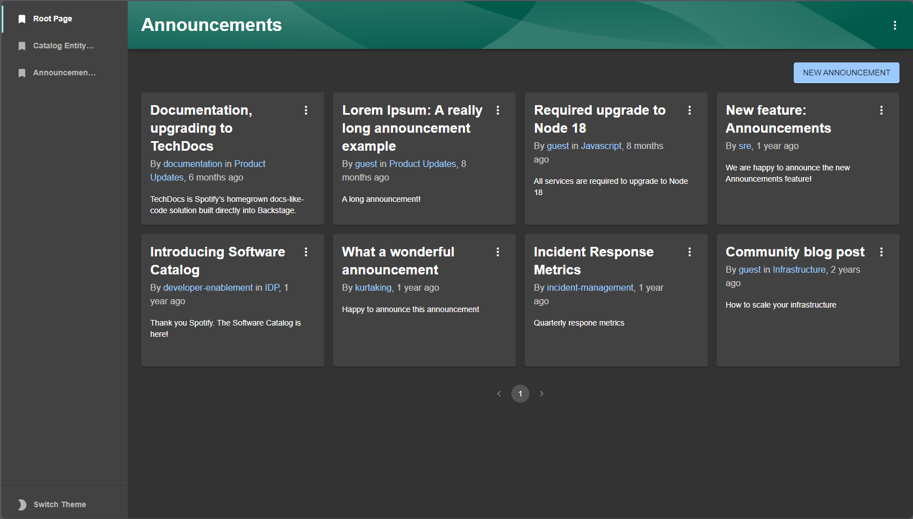

# Announcements plugin for Backstage

## Overview

The Announcements plugin is a frontend, backend, and common plugin that manages and displays announcements within Backstage.

This plugin provides:

- a component to display the latest announcement as a banner, if there is one
- a component to display the latest announcements, for example on a homepage
- pages to list, view, create, edit and delete announcements
- integration with the [`@backstage/plugin-search`](https://github.com/backstage/backstage/tree/master/plugins/search) plugin
- integration with the [`@backstage/plugin-permission-backend`](https://github.com/backstage/backstage/tree/master/plugins/permission-backend) plugin

## Installation

Find [installation instructions](./docs/index.md#installation) in our documentation.

## How does it look?

### Latest announcement banner

### Announcements card

### Announcements page

### Announcements search

## License

This library is under the [MIT](LICENSE.md) license.

## Special thanks & Disclaimer

We want to thank [K-Phoen](<(https://github.com/K-Phoen/backstage-plugin-announcements)>) and [Procore-oss](https://github.com/procore-oss/backstage-plugin-announcements) for their work and contributions to the announcements plugin. They have provided an excellent foundation for announcements within our organization.

To meet Clark's internal needs and desires we are making many changes and enhancements to the announcements plug-in. We are excited to share the changes with the community at large and welcome feedback and contributions.
